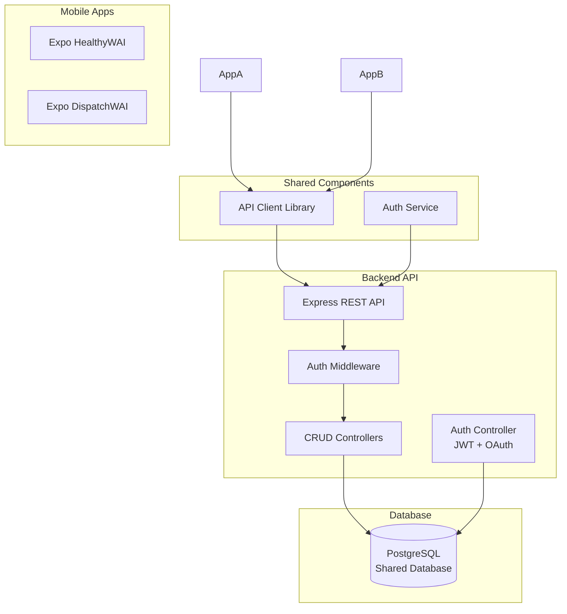

# Two

Mobile Apps with Shared Database Architecture

## Architecture Overview

The architecture consists of:

- **Two Expo mobile apps** (HealthyWAI and DispatchWAI) that share a common backend
- **Node.js/Express REST API** backend that handles all database operations
- **PostgreSQL database** as the shared data store
- **Authentication service** supporting both JWT tokens and OAuth providers
- **Shared API client library** for consistent data access across both apps

## Architecture Diagram




## Project Structure

```javascript
waione/
├── backend/                    # Backend API server
│   ├── src/
│   │   ├── config/            # Database, auth configs
│   │   ├── controllers/       # Route controllers
│   │   ├── middleware/        # Auth, validation middleware
│   │   ├── models/            # Database models (Sequelize/TypeORM)
│   │   ├── routes/            # API routes
│   │   ├── services/          # Business logic services
│   │   ├── utils/             # Helper functions
│   │   └── app.js             # Express app setup
│   ├── migrations/            # Database migrations
│   ├── seeds/                 # Database seed data
│   └── package.json
│
├── healthywai/                # HealthyWAI Expo mobile app
│   ├── src/
│   │   ├── api/               # API client integration
│   │   ├── components/        # UI components
│   │   ├── screens/           # App screens
│   │   ├── navigation/        # Navigation setup
│   │   ├── services/          # App-specific services
│   │   └── utils/             # Utilities
│   ├── app.json
│   └── package.json
│
├── dispatchwai/               # DispatchWAI Expo mobile app
│   ├── src/
│   │   ├── api/               # API client integration
│   │   ├── components/        # UI components
│   │   ├── screens/           # App screens
│   │   ├── navigation/        # Navigation setup
│   │   ├── services/          # App-specific services
│   │   └── utils/             # Utilities
│   ├── app.json
│   └── package.json
│
├── shared/                    # Shared code between apps
│   ├── api-client/            # Shared API client library
│   │   ├── src/
│   │   │   ├── client.js      # Axios/fetch wrapper
│   │   │   ├── endpoints.js   # API endpoint definitions
│   │   │   └── auth.js        # Auth helpers
│   │   └── package.json
│   └── types/                 # Shared TypeScript types (optional)
│
└── docker-compose.yml         # Local development setup
```


## Implementation Details

### Backend API ([backend/src/app.js](backend/src/app.js))

- Express server with CORS enabled for mobile apps
- Environment-based configuration (development/production)
- Error handling middleware
- Request logging
- Health check endpoint

### Database Layer ([backend/src/models/](backend/src/models/))

- Use Sequelize ORM or TypeORM for database abstraction
- Define models for all shared tables
- Support migrations for schema versioning
- Connection pooling for performance

### Authentication ([backend/src/controllers/authController.js](backend/src/controllers/authController.js))

- JWT token generation and validation
- OAuth integration (Google, Apple, Facebook)
- User registration and login endpoints
- Token refresh mechanism
- Password hashing with bcrypt

### CRUD Operations ([backend/src/controllers/](backend/src/controllers/))

- RESTful endpoints for each resource:
- `GET /api/resource` - List all
- `GET /api/resource/:id` - Get one
- `POST /api/resource` - Create
- `PUT /api/resource/:id` - Update
- `DELETE /api/resource/:id` - Delete
- Input validation with express-validator
- Error handling and status codes

### Shared API Client ([shared/api-client/src/client.js](shared/api-client/src/client.js))

- Axios-based HTTP client
- Automatic token injection in headers
- Token refresh on 401 responses
- Request/response interceptors
- Type-safe endpoint definitions

### Mobile Apps

Both apps will:

- Use the shared API client library
- Implement authentication flows (login, signup, OAuth)
- Have app-specific UI and navigation
- Share common data models and types
- Handle offline scenarios (optional, for future)

## Technology Stack

**Backend:**

- Node.js + Express
- PostgreSQL
- Sequelize ORM (or TypeORM)
- JWT (jsonwebtoken)
- Passport.js for OAuth
- express-validator
- dotenv for configuration

**Mobile Apps:**

- Expo SDK
- React Navigation
- AsyncStorage for token persistence
- Expo AuthSession for OAuth
- React Query or SWR for data fetching (optional)

**Shared:**

- Axios for HTTP client
- JavaScript/TypeScript

## Database Schema Considerations

- User authentication tables (users, sessions, oauth_providers)
- App-specific tables with proper indexing
- Timestamps (created_at, updated_at) on all tables
- Soft deletes where appropriate
- Foreign key relationships properly defined

## Security Considerations

- API rate limiting
- Input sanitization
- SQL injection prevention (via ORM)
- HTTPS in production
- Secure token storage in mobile apps
- Environment variables for secrets
- CORS configuration

## Development Workflow

1. Start PostgreSQL database (Docker or local)
2. Run backend API server
3. Develop mobile apps against local API
4. Use environment variables for API endpoints
5. Test CRUD operations from both apps

## Deployment Strategy

- Backend: Deploy to cloud (AWS, Heroku, Railway, etc.)